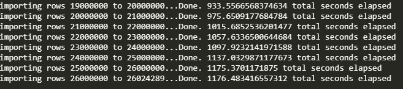

# Movies - ETL

## Project Overview
This project will look closely at the data pipeline process called Extract-Transfer-Load(ETL). This is a core concept in data engineering and is often used to move data around while ensuring that the data is consistent and maintains it's integrity. This process allows for a high degree of trust and reliability when performing analysis against the data. Further, a well designed ETL pipeline strives to automate as much of the data wrangling process as possible while leaving more time for analysis and modeling based on the final results. We can also create data stores using the ETL process that perform more efficiently while blending data from multiple sources. In this implementation, Python and Pandas will be used to perform the data wrangling while PostgreSQL will be used to store the finished database.

- Deliverables:
  1. Design an ETL function to read three different data files
  2. Extract and Transform Wikipedia data
  3. Extract and Transform Kaggle data
  4. Create the movie data and store in PostgreSQL

## Resources
- Database Client: pgAdmin v5.2
- Database Server: PostgreSQL v13
- Data Source(s) : wikipedia-movies.json, ratings.csv, movies_metadata.csv
- Software: Python 3.7.10, Visual Studio Code 1.56.2, Jupyter Notebook Server 6.3.0

## Results

### Create ETL function and Read Files

This process required reading one JSON file, wikipedia, and two csv files - movie ratings and movies metadata. As such, 3 different file references were passsed into the ETL function and 3 dataframes are send back from the function. Each dataframe is then displayed showing the top 5 records.

### Extract and Transform Wikipedia data

Following from the above process, once all files are read and loaded into dataframes, we proceed to investigate carefully the wikipedia dataframe in more detail. Our goal is to clean the data with the intent of having a final and very organized table that can be used for analysis. We initially started with 193 columns of movie data, some of which contains information that is not suited for our analyses. Also, some columns contained duplicate data which needed to be merged, date and time formats that needed to be standardized, dollar values that had different formats and columns with missing key or null values. After the data wrangling process we were able to reduce the usable columns down to 23 clean attributes that are formatted correctly based on data type.

### Extract and Transform Kaggle data 

The Kaggle data was similarily analyzed and the dataframe of 24 columns were evaluated for inclusion in the final movie dataframe. After formatting columns and removing the not relevant data, the final cleaned kaggle dataframe was merged with the wikipedia final dataframe into a separate movie dataframe.

 Decisions were made then to remove any unnecessary columns, merging the data intelligently where possible in the movie dataframe, missing data updated accordingly and columns renamed properly. We then looked at the ratings dataframe, clean all counts and then merge the movie data with the ratings data creating a movies with ratings dataframe. At this stage where we have merged all 3 files together into a final movies with ratings dataframe, we are then left with 41 cleaned columns that can be trusted as our final data collection. 

### Create the Movie Database

Now that we have a reliable and cleaned movie dataframe, we can store this into our PostgreSQL database called movie_data. To perform this task, we create a secure connection to the database and replace the current data in the movies table. This can be seen below where the count is determined once the data has been committed to the movies table.

For the ratings data, we delete the ratings table in the SQL database and recreate it from scratch. The results are shown below in a record count taken from the ratings table once this is completed.

As the data is loaded, feedback is also provided via an elapsed messaging progress window as shown below.

## Overall Summary

The overall ETL process allows for the use of reliable and consistent data at the final stage. Further, by loading the final results into a database we can have the data availble for hosting to other users with secure connections. We can also continue to update the ratings and the movies tables on an incremental on-going basis as may be required in the future.
