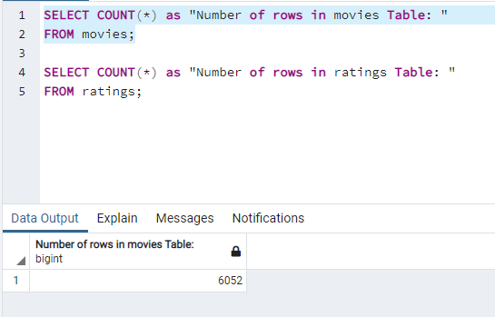
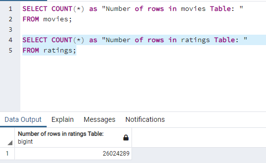

# Movies - ETL

## Project Overview
This project will look closely at the data pipeline process caled ETL or Extract-Transfer-Load. This is a core concept in data engineering and is often used to move data around while ensuring that the data is consistent and maintains it's integretity. This process allows for a high degree of trust and reliability when performing analysis against the data. Further, a well designed ETL pipeline strives to automate as much of the data wrangling process as possible while leaving more time for analysis and modeling. We can also create data stores using the ETL process that perform more efficiently while  blending data from multiple sources. In this implementation, Python and Pandas will be used to perform the data wrangling while PostgreSQL will be used to store the finished data.

- Deliverables:
  1. Design an ETL function to read three different data files
  2. Extract and Transform Wikipedia data
  3. Extract and Transform Kaggle data
  4. Create the movie data and store in PostgreSQL

## Resources
- Database Client: pgAdmin v5.2
- Database Server: PostgreSQL v13
- Data Source(s) : wikipedia-movies.json, ratings.csv, movies_metadata.csv
- Software: Python 3.7.10, Visual Studio Code 1.56.2, Jupyter Notebook Server 6.3.0

## Results

### Create ETL function and Read Files

This process required reading one JSON file, wikipedia, and two csv files - movie ratings and movies metadata. As such, 3 different file references were passsed into the ETL function and 3 dataframes are send back from the function. Each dataframe is then displayed showing the top 5 records.

### Extract and Transform Wikipedia data

Following from the above process, once all files are read and loaded into dataframes, we proceed to investigate carefully the wikipedia dataframe in more detail. Our goal is to clean the data with the intent of having a final very organized table that can be used for analysis. We initially started with 193 columns of movie data some of which contains information that is not needed for our implementation. Also, some columns contained duplicate data which needed to be merged, date and time formats that needed to be standardized, dollar values that had different formats and columns with missing key or null values. After the data wrangling process we were able to reduce the usable columns down to 23 clean and formated attributes.

### Extract and Transform Kaggle data 

The Kaggle data was similarily analyzed and the dataframe of 24 columns were evaluated for inclusion in the final movie dataframe. After formatting columns and removing the ones not relevant, the final cleaned kaggle dataframe was merged with the wikipedia final dataframe into a separate movie dataframe. Decisions were made then to remove any unnecessary columns, merging the data intelligently where possible in the movie dataframe, missing data inserted and columns renamed. We then look at the ratings dataframe, clean all counts and then merge the movie data with the ratings data creating a movies with ratings dataframe. At this stage where we have merged all 3 files together into a final movies with ratings dataframe we are left with 41 cleaned columns that can be trusted and used for analysis as may be required. 

### Create the Movie Database

## Overall Summary

